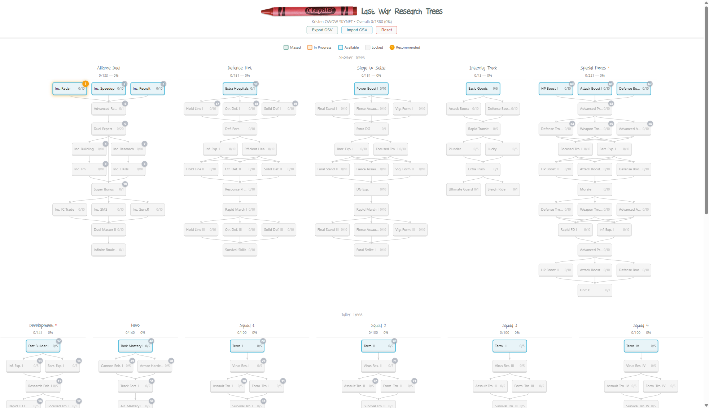

# Last War: Survival — Research Tree Visualizer

**Built by Kristen OWOW SKYNET**

Interactive research tree tracker for [Last War: Survival](https://play.google.com/store/apps/details?id=com.fun.lastwar.gp). Track all 11 research trees, see costs and prerequisites at a glance, and follow the recommended research path to maximize your progression.



## Live Site

**Open directly in your browser — no download needed:**

- [https://extremesecrecy.github.io/lastwar-research-trees/](https://extremesecrecy.github.io/lastwar-research-trees/)

## Server Guides (Live Links)

| Guide | What It Covers |
|-------|---------------|
| [Alliance Support Hub](https://extremesecrecy.github.io/lastwar-research-trees/guides/alliance_support_hub.html) | Alliance support hub levels and bonuses |
| [Building Reference](https://extremesecrecy.github.io/lastwar-research-trees/guides/building_reference.html) | All building upgrade requirements and costs |
| [Radar Guide](https://extremesecrecy.github.io/lastwar-research-trees/guides/radar_guide.html) | Radar mission system — stacking, timers, levels 1-17 |
| [VS Weekly Planner](https://extremesecrecy.github.io/lastwar-research-trees/guides/vs_weekly_planner.html) | Day-by-day VS Duel battle plan (what to save, what to spend) |
| [Waterfall Guide](https://extremesecrecy.github.io/lastwar-research-trees/guides/waterfall_guide.html) | Troop waterfall training strategy for max Arms Race points |

## Quick Start (Offline)

1. Download or clone this repo
2. Open `research_trees_visual.html` in any modern browser
3. That’s it — no install, no server, no internet required

## Research Tree Features

- **11 research trees** displayed in two horizontal bands with SVG connection lines
- **Click any node** to adjust your current research level (+/-, MAX)
- **Horizontal scroll** on smaller screens — all trees accessible regardless of screen size
- **Color-coded states**: green = maxed, orange = in progress, blue = available, gray = locked
- **Recommended research path**: gold pulsing badges show what to research next, based on pro guides
- **Hover tooltips** show costs, prerequisites, remaining resources, and recommended step info
- **Auto-saves** to browser localStorage — your progress persists between sessions
- **Import/Export CSV** to back up or share your progress data

## Color Legend

| Color | Meaning |
|-------|---------|
| Green border | Maxed (fully researched) |
| Orange border | In progress (partially researched) |
| Blue border | Available (prerequisites met, ready to research) |
| Gray border | Locked (prerequisites not met) |
| Gold badge (pulsing) | Recommended next research |
| Gray numbered badge | Future recommended research |

## Recommended Research Path

The numbered badges show a universal “best research order” based on pro consensus:

1. **Alliance Duel core** — Duel Expert doubles all VS Duel points
2. **Extra Hospitals** — protect your troops from permanent losses
3. **Development tree** — build, research, and train faster
4. **Squad 1** — cheapest squad tree, biggest impact on your main march
5. **Hero tree Tier I** — all three vehicle branches
6. **Special Forces** — path toward T10 troops
7. **Defense Fort** — base defense combat nodes
8. **Squad 2** — secondary squad buffs

As you max nodes, the gold “UP NEXT” badge automatically advances to the next step.

## Customizing / Rebuilding

```bash
# Edit research_trees.csv — set HaveIt=1 for levels you've completed
# Then regenerate the HTML:
python build_research_trees.py
```

**Requirements:** Python 3.6+ (no external packages)

### Customizing the Recommended Path
Edit `recommended_path.json` to change the research order. Each entry has:
- `tree` — tree display name (e.g., "Alliance Duel", "Development")
- `node` — node name exactly as shown in-game
- `reason` — short explanation shown in tooltips

Then rebuild with `python build_research_trees.py`.

## Get AI-Powered Research Advice

Want personalized strategy advice? You can export your progress and ask **ChatGPT, Claude, Gemini, or any AI assistant** to analyze it for you.

### Step 1: Export Your Progress
1. Open the [Research Tree Visualizer](https://extremesecrecy.github.io/lastwar-research-trees/) and click through your trees to set your current research levels
2. Click **"Export CSV"** — this downloads `research_trees.csv` with your progress

### Step 2: Get the AI Advisor Prompt
Download [`ai_advisor_prompt.md`](https://raw.githubusercontent.com/extremesecrecy/lastwar-research-trees/main/ai_advisor_prompt.md) (right-click → "Save link as...") — this file teaches any AI how to read your CSV and give you expert Last War research advice.

### Step 3: Ask Your AI
Open ChatGPT, Claude, Gemini, or any AI chat and send this message:

> **Read these two files and analyze my Last War research progress. Tell me what to research next, what I’m doing well, and where I need to improve.**

Then attach both files:
1. `ai_advisor_prompt.md` (the advisor instructions)
2. `research_trees.csv` (your exported progress)

### What You’ll Get
The AI will analyze your data and tell you:
- Your overall and per-tree completion percentages
- Where you stand on the recommended research path
- Your **next 5 research priorities** with costs and reasons
- Total resources needed to hit your next milestones
- Warnings if you’ve skipped critical research (like Duel Expert!)

You can then ask follow-up questions like:
- *"How much Valor do I need to finish Alliance Duel?"*
- *"Should I start Special Forces or finish Development first?"*
- *"What’s the fastest path to T10 troops?"*
- *"I have 50,000 gold and 2,000 Valor — what should I spend on?"*

## Sharing With Your Alliance

Share the live link — anyone can open it in their browser. Or zip the folder for offline use. Each person’s research progress saves locally in their own browser.

## Files

| File | Purpose |
|------|---------|
| `research_trees_visual.html` | **The app** — open this in your browser |
| `research_trees.csv` | Research data (costs, prerequisites, your progress) |
| `recommended_path.json` | Ordered research sequence (75 steps) |
| `ai_advisor_prompt.md` | **AI advisor instructions** — give this + your CSV to any AI for personalized advice |
| `build_research_trees.py` | Build script that generates the HTML |
| `tree_data/*.json` | Raw tree structure data from game |
| `guides/*.html` | Visual server guides (see table above) |
| `DKCrayonCrumble.ttf` | Display font |
| `crayon.png` | Header logo |

## Data Sources

Tree structure and cost data extracted from [Captain Hedgehog’s Battle HQ](https://cpt-hedge.com/calculators/research) — the most comprehensive Last War calculator available.

---

*Built with calculated precision by Kristen OWOW SKYNET. Ready for Judgment Day.*
