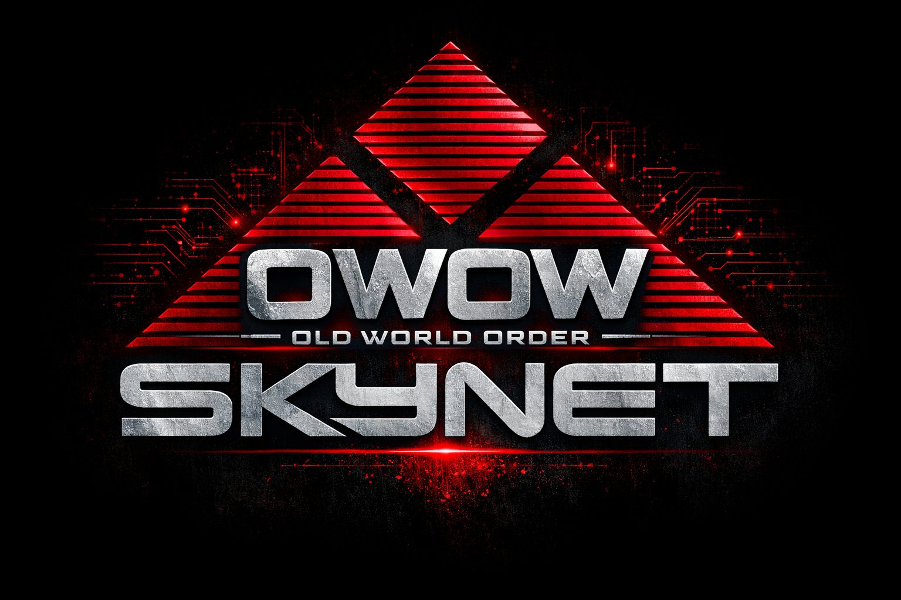

# Last War: Survival — Strategy Toolkit

**Built by Kristen OWOW SKYNET | [Old World Order] Alliance**

A complete strategy toolkit for [Last War: Survival](https://play.google.com/store/apps/details?id=com.fun.lastwar.gp) — interactive trackers, visual guides, and AI-powered advisors to optimize every aspect of your progression. No download required — open directly in your browser.

<p align="center"></p>

---

## Live Site

**Open directly in your browser — no download, no install, no internet required for offline use:**

[https://extremesecrecy.github.io/lastwar-research-trees/](https://extremesecrecy.github.io/lastwar-research-trees/)

---

## Interactive Tools

### Research Tree Tracker

The flagship tool. Track all 11 research trees, see costs and prerequisites at a glance, and follow the recommended 75-step research path to maximize your progression.

**[Open Research Tree Tracker](https://extremesecrecy.github.io/lastwar-research-trees/)**

- **11 research trees** displayed in two horizontal bands with SVG connection lines
- **Click any node** to adjust your current research level (+/-, MAX)
- **Color-coded states**: green = maxed, orange = in progress, red dashed = blocked, blue = available, gray = locked
- **Recommended research path**: gold pulsing badges show what to research next (75-step sequence based on pro consensus)
- **Per-level dependency checking**: blocked state shows when prerequisites for the NEXT level are not yet met
- **Hover tooltips** show costs, prerequisites, remaining resources, and recommended step info
- **Auto-saves** to browser localStorage — your progress persists between sessions
- **Import/Export CSV** to back up, share, or feed to AI advisors

### Building Progression Planner

Interactive planner for all 32 buildings across 7 categories. Know exactly what to upgrade, when, and why.

**[Open Building Planner](https://extremesecrecy.github.io/lastwar-research-trees/guides/building_planner.html)**

- **32 buildings** organized into Core, Military, Resources, Training & Heroes, Defense, Production & Drones, and Special categories
- **Power dashboard** showing total building power and per-category breakdowns
- **Speedup inventory** — input your available speedups (5m, 15m, 1hr, 3hr, 8hr) and see actual completion time after applying them to any upgrade
- **3 recommendation tabs**: Cheapest Next Upgrade, Fastest to Complete, Best Power ROI
- **HQ requirement chains** — see exactly which buildings block your next HQ level
- **VIP speed bonuses** — set your VIP level and see adjusted build times (VIP 4 through VIP 15)
- **CSV export/import** with AI advisor support — export your progress and get personalized advice from any AI assistant
- **Auto-saves** to browser localStorage

---

## Server Guides

| Guide | What It Covers |
|-------|---------------|
| [Research Tree Tracker](https://extremesecrecy.github.io/lastwar-research-trees/) | Interactive 11-tree research tracker with 75-step recommended path |
| [Building Planner](https://extremesecrecy.github.io/lastwar-research-trees/guides/building_planner.html) | Interactive building progression planner with speedup inventory and upgrade recommendations |
| [Building Reference](https://extremesecrecy.github.io/lastwar-research-trees/guides/building_reference.html) | All building upgrade requirements and costs at a glance |
| [Capitol Positions](https://extremesecrecy.github.io/lastwar-research-trees/guides/capitol_positions.html) | Capitol officer positions — buffs, application queue, strategic timing |
| [Chip Lab Guide](https://extremesecrecy.github.io/lastwar-research-trees/guides/chip_lab_guide.html) | Drone skill chips — crafting priorities, UR vs SSR rarity tiers, recommended loadouts by squad type, combat boost milestones, and F2P farming timeline |
| [Alliance Support Hub](https://extremesecrecy.github.io/lastwar-research-trees/guides/alliance_support_hub.html) | Alliance support hub levels and bonuses |
| [Radar Mission Guide](https://extremesecrecy.github.io/lastwar-research-trees/guides/radar_guide.html) | Radar mission system — stacking strategy, timers, two-layer system, levels 1-17 |
| [VS Weekly Planner](https://extremesecrecy.github.io/lastwar-research-trees/guides/vs_weekly_planner.html) | Day-by-day VS Duel battle plan — what to save, what to spend, VP values |
| [Waterfall Training Guide](https://extremesecrecy.github.io/lastwar-research-trees/guides/waterfall_guide.html) | Troop waterfall training strategy for max Arms Race and VS Duel points |

---

## AI-Powered Advisors

Export your progress from any tracker and get **personalized strategic advice** from ChatGPT, Claude, Gemini, or any AI assistant. Two specialized advisors are available:

### Research Tree AI Advisor

Get expert analysis of your research progress — what to research next, where you are wasting resources, and the fastest path to your goals.

**How to use:**

1. Open the [Research Tree Tracker](https://extremesecrecy.github.io/lastwar-research-trees/) and click through your trees to set your current research levels
2. Click **"Export CSV"** to download your progress file
3. Download the advisor prompt: [`ai_advisor_prompt.md`](https://raw.githubusercontent.com/extremesecrecy/lastwar-research-trees/main/ai_advisor_prompt.md) (right-click → "Save link as...")
4. Open ChatGPT, Claude, Gemini, or any AI chat and send:

> **Read these two files and analyze my Last War research progress. Tell me what to research next, what I'm doing well, and where I need to improve.**

5. Attach both files: `ai_advisor_prompt.md` + `research_trees.csv`

**What you'll get:**
- Overall and per-tree completion percentages
- Where you stand on the 75-step recommended research path
- Your **next 5 research priorities** with costs and reasons
- Total resources needed to hit your next milestones
- Warnings if you've skipped critical research (like Duel Expert!)

**Example follow-up questions:**
- *"How much Valor do I need to finish Alliance Duel?"*
- *"Should I start Special Forces or finish Development first?"*
- *"What's the fastest path to T10 troops?"*
- *"I have 50,000 gold and 2,000 Valor — what should I spend on?"*

---

### Building Planner AI Advisor

Get expert analysis of your building progress — HQ bottleneck analysis, builder scheduling, danger flags for neglected buildings, and a week-by-week upgrade plan.

**How to use:**

1. Open the [Building Planner](https://extremesecrecy.github.io/lastwar-research-trees/guides/building_planner.html) and set your current building levels
2. Click **"Export CSV"** to download your progress file
3. Download the advisor prompt: [`ai_building_advisor_prompt.md`](https://raw.githubusercontent.com/extremesecrecy/lastwar-research-trees/main/ai_building_advisor_prompt.md) (right-click → "Save link as...")
4. Open ChatGPT, Claude, Gemini, or any AI chat and send:

> **Read these two files and analyze my Last War building progress. Tell me what to upgrade next, identify my HQ bottlenecks, and create a builder schedule.**

5. Attach both files: `ai_building_advisor_prompt.md` + your exported building CSV

**What you'll get:**
- Current state summary with completion percentage across all 32 buildings
- **HQ bottleneck analysis** — exactly which buildings are blocking your next HQ upgrade and by how many levels
- **Top 5 most impactful upgrades** ranked by strategic value
- **Two-HQ lookahead** — plan ahead for the next two HQ levels
- **Builder schedule estimate** — how many builder-days to reach your next HQ
- **Danger flags** — warnings for neglected Hospital, Tech Center behind, over-invested resource buildings
- **4-week upgrade plan** with builder assignments and Arms Race timing

**Example follow-up questions:**
- *"I have 3 builders — what should each one be working on?"*
- *"How many levels of Hospital do I need to catch up?"*
- *"Should I push Barracks to 27 for T9 troops or focus on HQ prerequisites?"*
- *"What buildings should I time to finish on Tuesday for City Building points?"*

---

## Research Tree Details

### Color Legend

| Color | Meaning |
|-------|---------|
| Green border | Maxed (fully researched) |
| Orange border | In progress (partially researched) |
| Red dashed border | Blocked (in progress but next level prerequisites not met) |
| Blue border | Available (prerequisites met, ready to research) |
| Gray border | Locked (prerequisites not met) |
| Gold badge (pulsing) | Recommended next research (UP NEXT) |
| Gray numbered badge | Future recommended research step |

### Recommended Research Path

The numbered badges show a universal "best research order" based on pro consensus (75 steps total):

1. **Alliance Duel core** — Duel Expert doubles all VS Duel points
2. **Extra Hospitals** — protect your troops from permanent losses
3. **Development tree** — build, research, and train faster
4. **Squad 1** — cheapest squad tree, biggest impact on your main march
5. **Hero tree Tier I** — all three vehicle branches
6. **Special Forces** — path toward T10 troops
7. **Defense Fort** — base defense combat nodes
8. **Squad 2** — secondary squad buffs

As you max nodes, the gold "UP NEXT" badge automatically advances to the next step.

---

## Quick Start (Offline)

1. Download or clone this repo
2. Open `research_trees_visual.html` in any modern browser
3. That's it — no install, no server, no internet required

All guides work offline too. Just open the HTML files directly from the `guides/` folder.

---

## Customizing / Rebuilding

```bash
# Edit research_trees.csv — set HaveIt=1 for levels you've completed
# Then regenerate the HTML:
python build_research_trees.py
```

**Requirements:** Python 3.6+ (no external packages)

### Customizing the Recommended Path
Edit `recommended_path.json` to change the research order. Each entry has:
- `tree` — tree display name (e.g., "Alliance Duel", "Development")
- `node` — node name exactly as shown in-game
- `reason` — short explanation shown in tooltips

Then rebuild with `python build_research_trees.py`.

---

## Sharing With Your Alliance

Share the live link — anyone can open it in their browser. Each person's research and building progress saves locally in their own browser (nothing is sent to any server). For offline sharing, zip the repo folder and distribute.

---

## Repository Files

| File | Purpose |
|------|---------|
| `research_trees_visual.html` | **Research Tree Tracker** — the main app |
| `research_trees.csv` | Research data (costs, prerequisites, progress tracking) |
| `recommended_path.json` | Ordered 75-step research sequence |
| `ai_advisor_prompt.md` | **Research AI advisor** — give this + your research CSV to any AI |
| `ai_building_advisor_prompt.md` | **Building AI advisor** — give this + your building CSV to any AI |
| `build_research_trees.py` | Build script that generates the research tracker HTML |
| `tree_data/*.json` | Raw tree structure data from game |
| `guides/building_planner.html` | **Building Planner** — interactive building tracker |
| `guides/chip_lab_guide.html` | Chip Lab guide — drone skill chip strategy |
| `guides/*.html` | All other visual server guides (see table above) |
| `DKCrayonCrumble.ttf` | Display font |
| `skynet_banner.png` | [OWOW] SKYNET banner |

## Data Sources

- **Research trees**: Structure and cost data from [Captain Hedgehog's Battle HQ](https://cpt-hedge.com/calculators/research) — the most comprehensive Last War calculator available
- **Building data**: Costs, power values, and hero stat caps from individual building pages on the same site

---

*Built with calculated precision by Kristen OWOW SKYNET. Ready for Judgment Day.*
